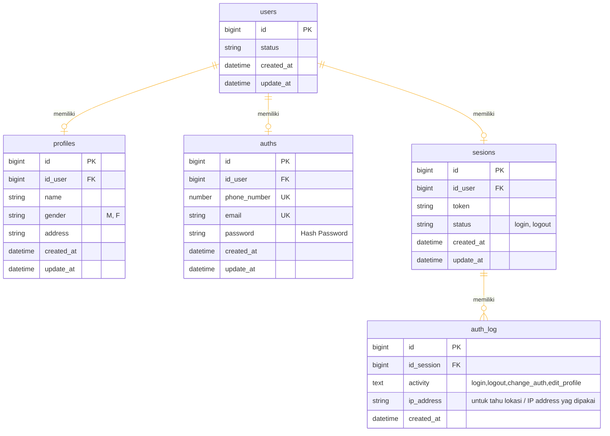

# ERD Auhhentication Flow

## Berikut merupakan ERD untuk Authentication Flow dengan mermaid

```mermaid

---
config:
    theme: 'default'
    themeVariables:
        lineColor: '#F8B229'
---
erDiagram
    users {
        bigint id PK
        string status
        datetime created_at
        datetime update_at
    }
    profiles{
        bigint id PK
        bigint id_user FK
        string name
        string gender "M, F"
        string address
        datetime created_at
        datetime update_at
    }

    auths {
        bigint id PK
        bigint id_user FK
        number phone_number UK
        string email UK
        string password "Hash Password"
        datetime created_at
        datetime update_at
    }

    sesions {
        bigint id PK
        bigint id_user FK
        string token
        string status "login, logout"
        datetime created_at
        datetime update_at
    }

    auth_log {
        bigint id PK
        bigint id_session FK
        text activity "login,logout,change_auth,edit_profile"
        string ip_address "untuk tahu lokasi / IP address yag dipakai"
        datetime created_at   
    }


    %% RELASI
    users ||--o| profiles : "memiliki"
    users ||--o| auths : "memiliki"
    users ||--o| sesions : "memiliki"
    sesions ||--o{ auth_log : "memiliki"
    
```